# TheGimbalStore - Android App

### Assumptions:

- There is a product store which has more physical stores along with an associated e-commerce website running live.
- The site is (physical) store independent. Stating that, all those users who visit the physical store need not have account in the e-commerce site but few of the users who have online account also visits the physical store occasionally for in-store experience.
- The e-commerce user profile has the mobile number  field mandated and all the user are using the same mobile number along with the application. ( which is used as a key that connects the mobile device with the live e-commerce site.
- Apart from an independent inventory for the e-commerece website, each physical store has an inventory information that can be accessed by the e-commerce system.
- The mobile app does not have any add-to-cart or buy product flow as the core problem is to address the recommendations with user network.

## The problem:
 The problem taken in hand with the above assumptions is to make the users connected with each other as well as to make them visit the (physical) store often, by providing a personalised experience based on their friends network as well as the purchase history.
### TechUsed:

- Native android stack.
    - I’ve used Fragments/Pagers/Horizontal/vertical scrolls and the default async task whenever required.
- Google push notifications service.
- Gimbal beacons , connecting to mobile devices through Bluetooth technology. To give a personalised inshore experience based in the user interest and recommendations by those in his network.
- A IBM websphere commerce exposing an api endpoint by using controllers, for accessing the product related information of the store.(Note: the mentioned e-commerce related application code are not in this code base and was maintained standalone with an front-end agreed data exchange contract)
    - Custom data-tables inside the e-commerce system to hold the reviews, recommendation and rating information(As web sphere commerce was not providing any out-of-the box recommendation/review engine but supported third party plugins).
    - In order to slash the dependency on a third party system to just build a review/recommandation system and considering the  time taken by the third-party plugin work flows, the custom table approach is chosen.
    - The in-store recommendations that are done through the IBM web sphere commerce’s management centre’s promotions section.

The solution - Redefining Recommendation and reviews:
     With the problem statement clear, the approach taken here is that the actual system has a set of users who are often using the site and occasionally visiting the physical store.

- The user can go through the product categories, product lists and product details in the mobile app.
- The user can add one or more of the existing users, from his contacts list to his e-commerce recommendation network.
- The user can ask his friend(s) to recommend a product in category.
- The user can ask his friend(s) to review a product (irrespective of there that friend has purchased this product).
- There are few physical stores and each stores have associated beacons and specific inventories based on the geography or the targeting user base.
    - Each of these beacons are identified with the data in the back end and the recommendations are done based on the user purchase/view history.
    - Each in-store(with the help of beacons) can interact with the users mobile application.
- User gets notified whenever a friend asks for a review (both product and category).
- User gets notified whenever a friend reviews the product that he has asked a review for.

The Naive top level architecture of the mobile application(initial phase with third-party review engine):
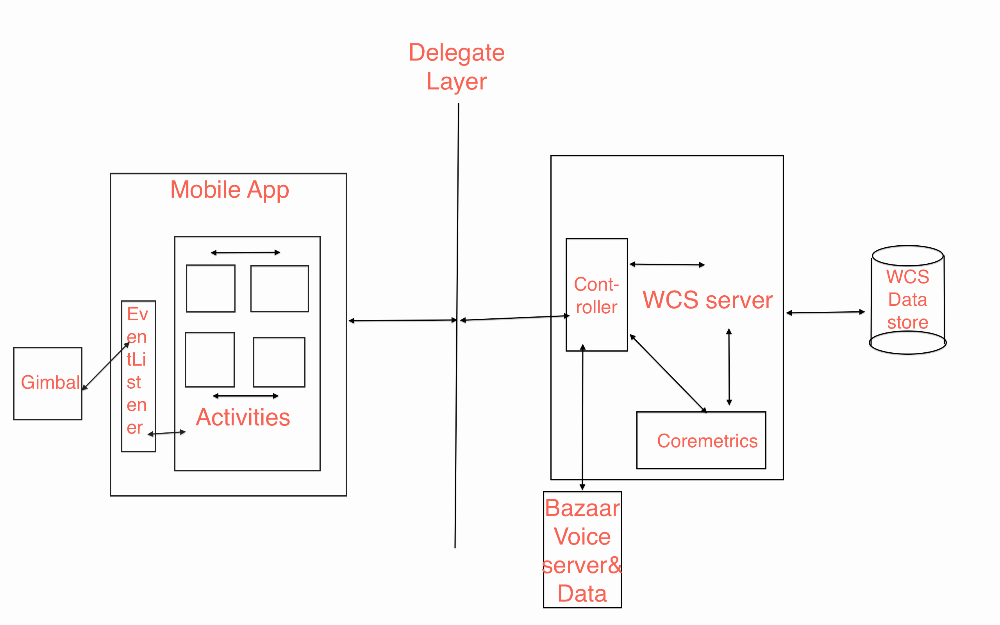
The base schema of the custom tables:
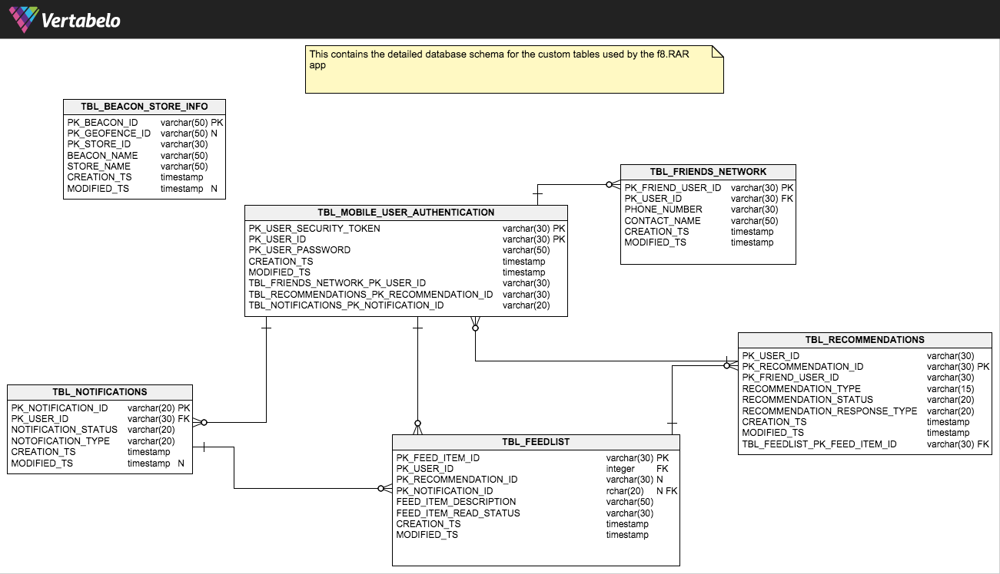

## The detailed user experience:
   The mobile application has 9 major screens which are as follows.

   - Auth screen : SignUp/SignIn(one time login) scr een that will add an android authenticator account to the mobile device registering to the api server with mobile credentials.
   - Home screen : that displays all the categories the store has.
   - The network screen - You can sync all your contacts to the e-commerce server to create a network with all this friends in your contact having a profile in that system.
   - The sub-categories view: Lists all the sub categories  with a gist of 10 top selling products in each sub category.
   - The products list view: List all the product in the selected sub category.
   - The product details view: Detailed view of the product selected.
   - The recommendations(feed list) view - Lists all the reviews and recommendation requests that your friend has asked you to do.
   - The (in-store) promotions view: This view exclusively contains the in-store related product promotions whenever he visits any place near the physical store (e.g.: a mall)
   - The(push) notifications system. The user will receive a push notification whenever the user has any updates in the feeds view, recommendations view and the promotions view

## The Auth Screen:
   The app features one-time authentication system by using the account authenticator class provided which enables us to add authentication account of the app through system settings. This activity is launched whenever there is no account exists in the system or whenever the user clicks add account button in the accounts view settings.
   - As the system does not support multiple accounts user will receive error whenever he tries to add more than one account.
   - Whenever the user opens the app, the activity checks whether there is any account added and logs in to the system as that user, to access the commerce controller API.
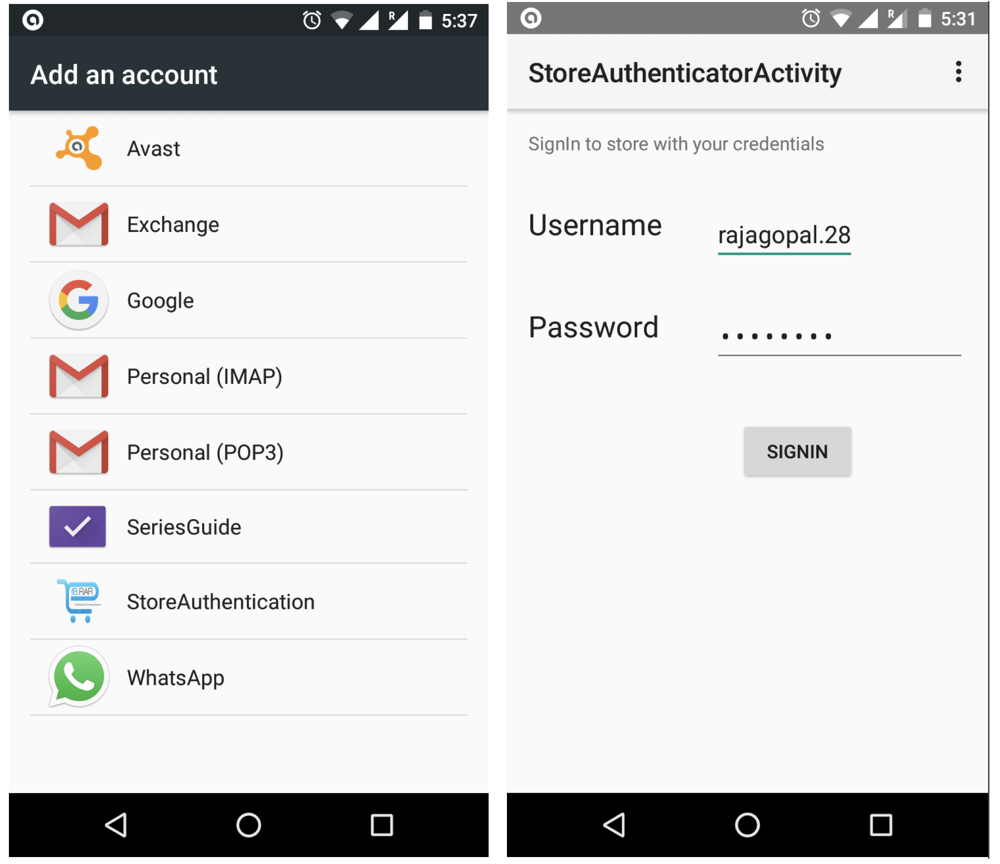

## The Settings dropdown:
Settings dropdown has links to 4 major options.
   * **Sync contacts**- accesses all the contacts in your mobile and sends the username, phone number pair to the server. The server validates with the phone number whether the user has access or not. The server creates a friends network for the current user with those friends having valid e-commerce account in the site. The contacts list is processed as chunks as the user contacts will be more than 500 in most cases.
    *  **Notification** will take to the notifications activity while the friends activities option will take to the friend recommendations view.
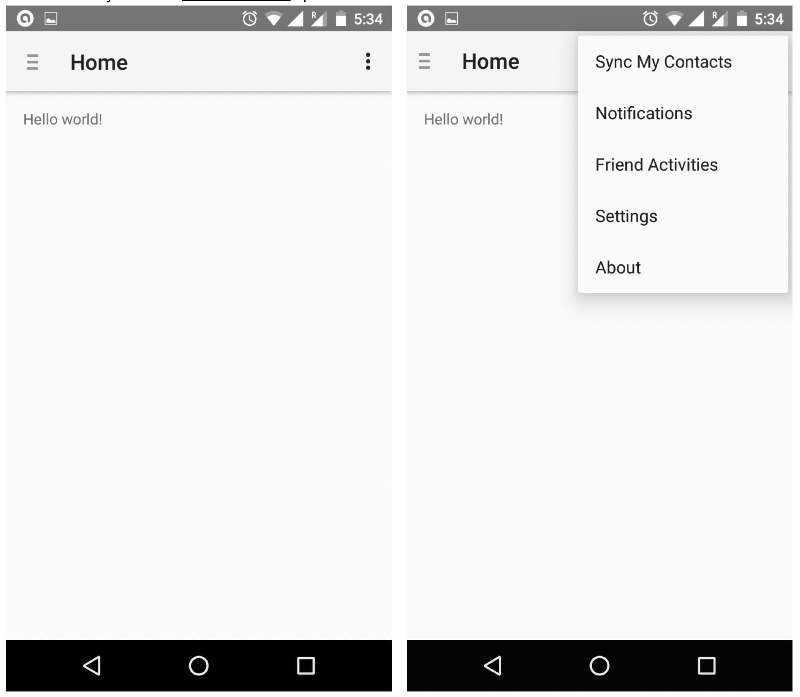

## The Home View:
   The home view essentially consists of a side drawer which is dynamically populated with the top category values. The home view primarily ensures that the user has a valid account added to the mobile system. The App also ensures that the bluetooth settings are turned on in order to recognise the beacons that are available in the physical stores.
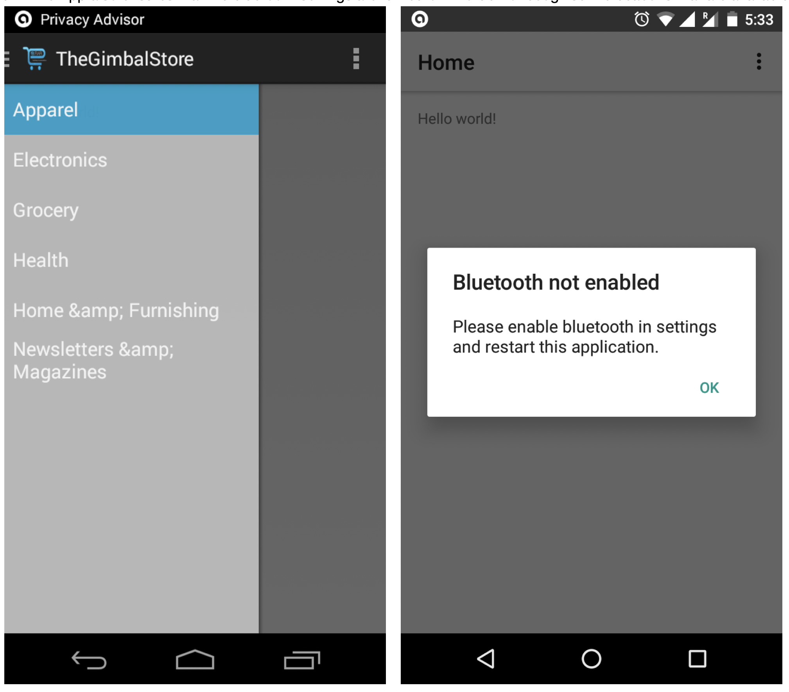

## The Sub-Category View:
   On choosing a category from the side drawer the user will be taken to the sub category view which essentially lists all the sub categories along with the 10 top selling products in each of the sub-categories. These to 10 products are sent from the commerce server by making use of the built-in core metrics interface in web sphere commerce.
   There is a vertical scroll for the actual list of sub-categories and a horizontal scroll for each sub-category product list which is achieved with the horizontal scroll view provided by the android platform. Clicking on any of the products will take you to the product view, while clicking on see all >> will take you to the all products view.
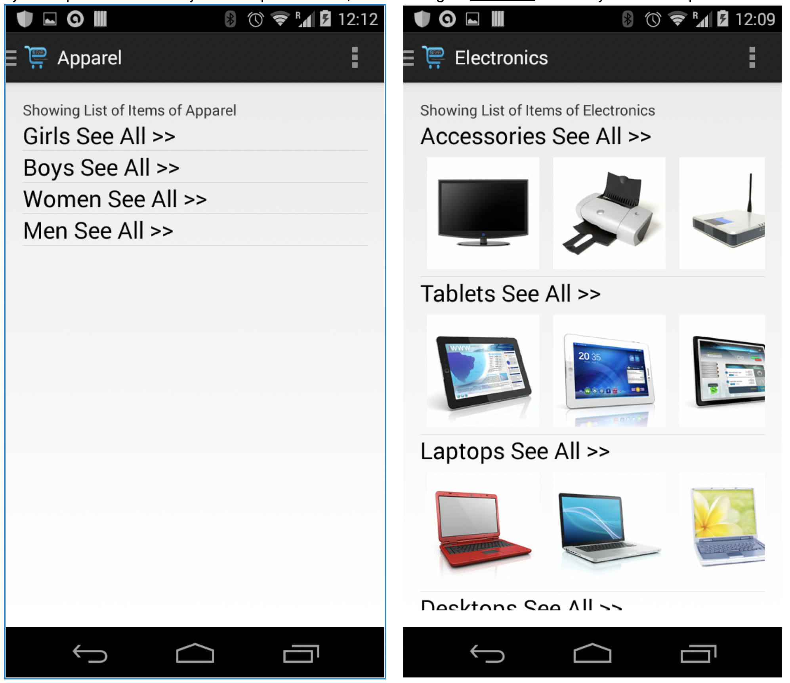

## The ProductsList View:
The product list view has 2 core functions.

- It essentially lists all the products under the sub category, which is a server side paged list view with a [show more] button at the end to load next page.
- Asking Friend(s) : This feature enables you to ask one or more of your friends to recommend you a product from the selected category. The pre-requisite is that the user should have a network created by syncing his contacts, to get the friends list.
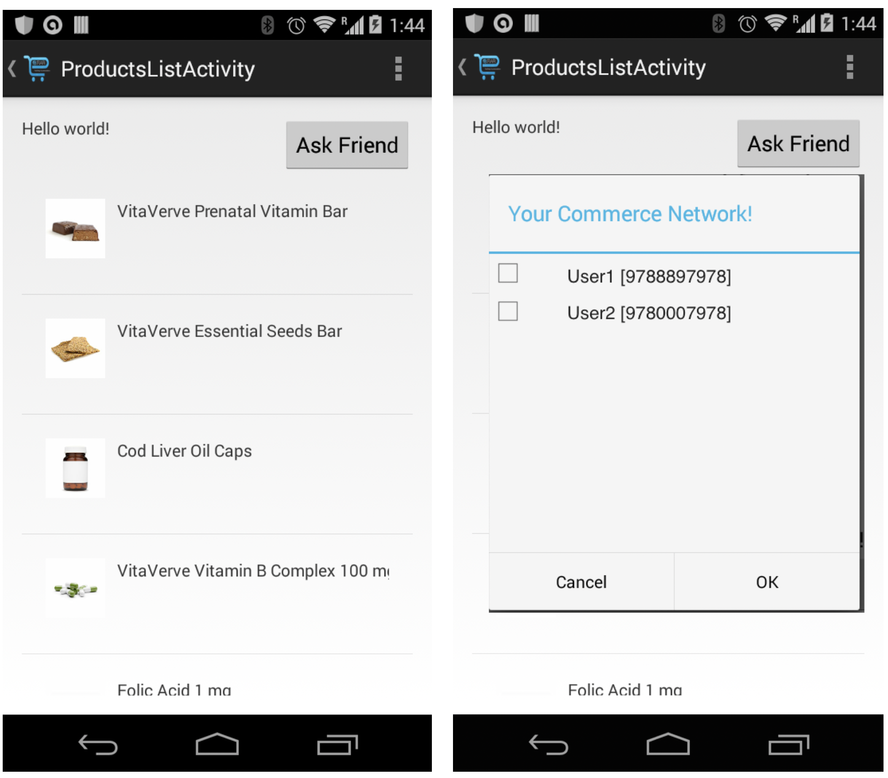

## The ProductDetails View:
The product detailed view has the core features of recommend this product to one or more friends in your networks. Ask friend(s) to review this product and asking a friend whether he recommends this product or not. A User can also review a product for which all those friend’s in his network, who asked for his review, will be notified by the server through push notifications.
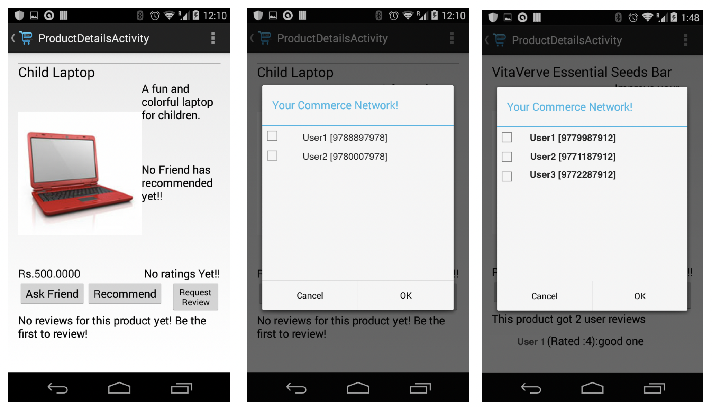


## The FeedList View:
  This view encompasses 3 tabs.

   - Recommendation from friends - List of all recent recommendation on any product that your friend has recommended you to try out.
   - Reviews by friends - List of all reviews from your friends on the product you
   - Product suggestions based the recommendation and reviews suggested.
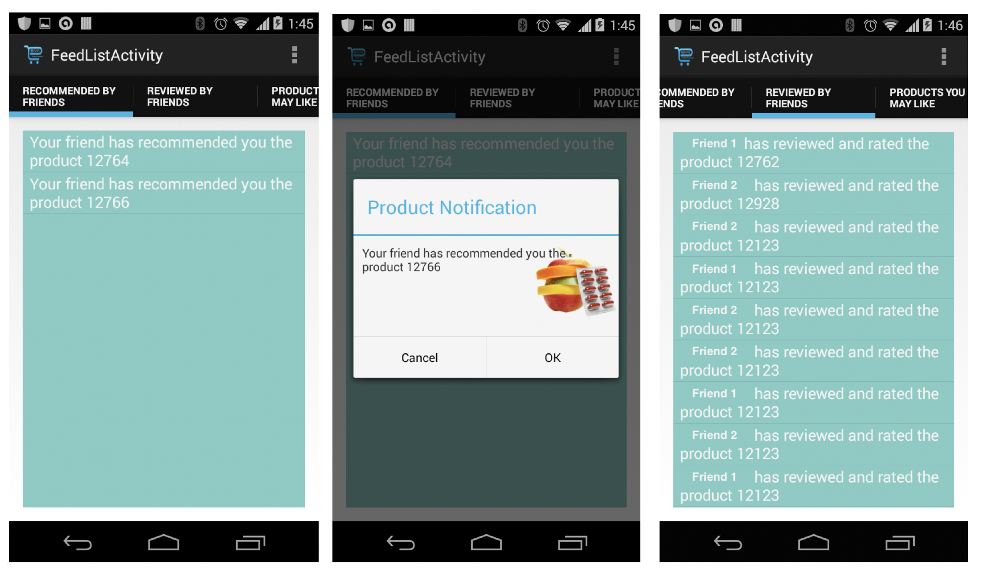


## The (in-store) promotions View:
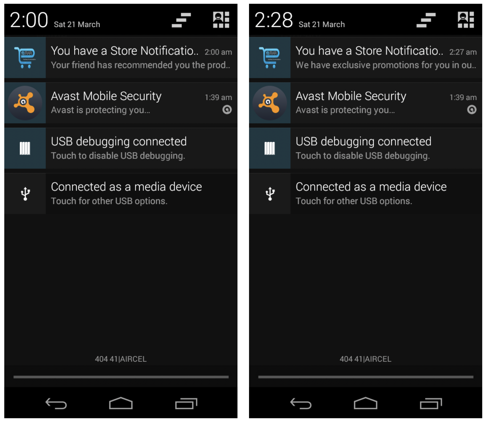
Whenever the user receives any region within the beacon proximity, the user will be notified with a set of offers that he can avail from the store available neat to him. The above diagram explains how the beacon technology is leveraged from our code. These promotions comprises of three sections.

   - Best sellers in the near store
   - Products in this store that are recommended by your friends ( but may not necessarily me recommended to you but to anyone in his friends network).
   - General promotions on product that are available in the store you are nearer too.
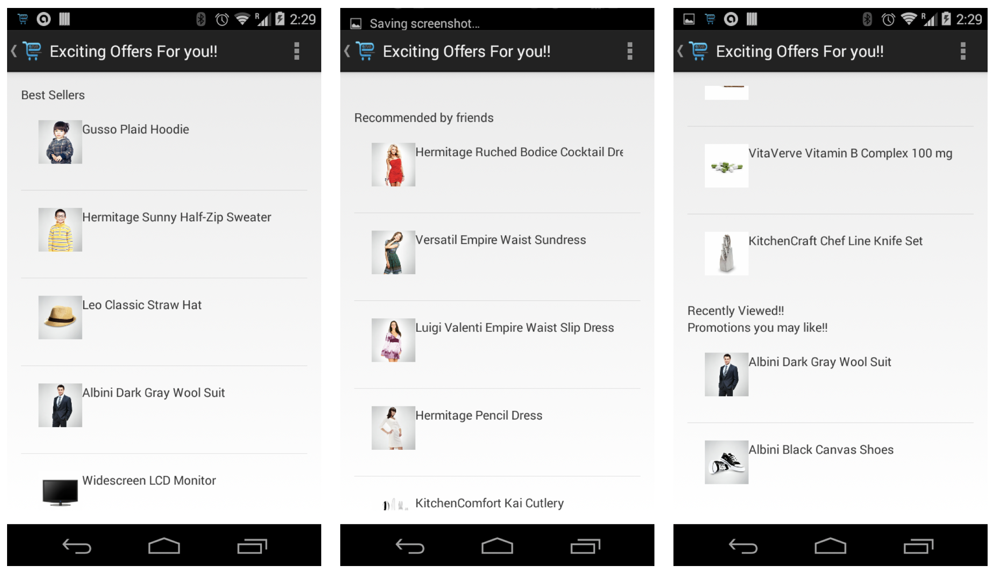


## The (push) notifications and Notifications View:
   Apart from the in-store notifications, all the notifications will take you to the feed-list view, in-store notifications will take you to the promotions view. The application user will be notified on following scenarios:

   - Whenever a friend has recommended you to try a product, irrespective of whether you have asked his opinion or not.
   - Whenever a friend has reviewed the product that you have asked him to give his review on.
   - Whenever you visit the proximity region of the beacon lying in a physical store.
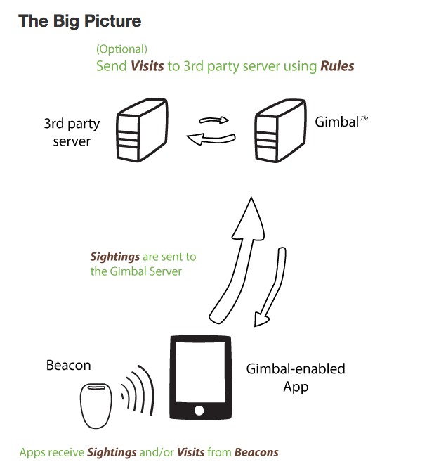

## The Biggest struggle - Native android UI VS the Async tasks to handle API over HTTP:
   Being a web developer calling any HTTP/API endpoint is as easy as
   ```javascript
   $.get(URL, successCB, errorCB);
   ```
   and loading image is like
   ```javascript
   .
   ```
   But the way native Android code handles is so tedious to make it get transformed to the view. Android native being a VCCV architecture the controller code is tightly couple with the view layer, making us hard to process the async tasks and transforming the response to the view layer. I have the approach depicted below by making use of the Object Oriented - Inheritance concept. As far as I can, I made sure, I make the code re-usable and following the coding standards. One of the major master pieces of the app is the HttpConnectionAsyncTask that I’ve created. It encompasses the maximum level of my “adhering to OOPs norms at that point of time”.
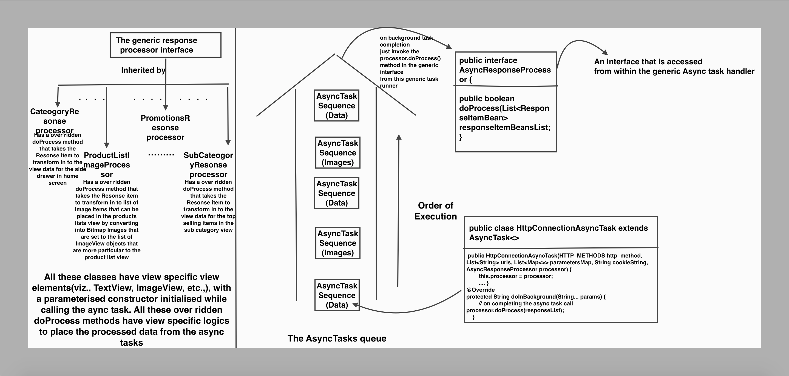

## Links referred:
- Gimbal library and API docs : https://docs.gimbal.com/gimbalsdk_v2upgrade.html

- Android
    - Fragments : http://developer.android.com/guide/components/fragments.html
    - PageAdapter : http://developer.android.com/reference/android/support/v4/view/PagerAdapter.html
    - Thanks markdown here to help me convert this document to github read https://github.com/adam-p/markdown-here/wiki/Markdown-Cheatsheet and Editor : http://jbt.github.io/markdown-editor/
